# github-traffic-archive

<p align="center">
  
</p>

<p align="center">
  <a href="https://github.com/HafidIdrissi/github-traffic-archive/actions/workflows/tests.yml"></a>
  <a href="https://github.com/HafidIdrissi/github-traffic-archive/releases"></a>
  <a href="pyproject.toml"></a>
  <a href="LICENSE"></a>
</p>

<p align="center">
  <a href="https://github.com/HafidIdrissi/github-traffic-archive/stargazers"></a>
  <a href="https://github.com/HafidIdrissi/github-traffic-archive/graphs/contributors"></a>
  <a href="https://github.com/HafidIdrissi/github-traffic-archive/issues"></a>
  <a href="https://github.com/HafidIdrissi/github-traffic-archive/labels/good%20first%20issue"></a>
</p>

<p align="center">
  <strong>GitHub deletes repository traffic after 14 days. This action keeps it in your own repository.</strong><br />
  Views, clones, referrers and popular paths become an accumulating JSON and CSV history—without a tracking pixel or an analytics account.
</p>

> [!TIP]
> **Want to make your first open-source contribution?** Pick a [`good first issue`](https://github.com/HafidIdrissi/github-traffic-archive/labels/good%20first%20issue), leave a comment, and we will avoid duplicating work. Documentation, tests and small fixes are welcome.

## Why this exists

GitHub exposes repository traffic through a rolling two-week window. Miss that window and the older measurements are permanently unavailable through the API.

| GitHub gives you | This project adds | You keep |
|:---|:---|:---|
| ⏳ A rolling 14-day window | 🔁 A scheduled snapshot and honest merge | 📚 A history that grows over time |
| 👁️ Views, clones, top referrers and paths | 🧰 A zero-dependency Python action and CLI | 📄 Human-readable JSON and CSV |
| 🔒 An admin-only API | 🔏 Optional Sigstore provenance | ✅ Verifiable file integrity and origin |

The raw traffic data stays between GitHub and your archive repository. For public repositories, optional attestations publish file hashes and provenance metadata—not the traffic values—to Sigstore's public transparency log.

## Quick start

### 1. Create a token

The recommended setup is a **fine-grained personal access token** limited to the repositories you want to archive, with:

```text
Repository permissions → Administration → Read-only
```

A classic PAT with the top-level `repo` scope also works, but grants much broader access. The built-in Actions `GITHUB_TOKEN` cannot read repository traffic; its `permissions:` block has no grantable `administration` key.

Store the PAT as a repository secret named `TRAFFIC_TOKEN`.

### 2. Add one workflow

Create `.github/workflows/traffic.yml` in the repository that will hold the archive:

```yaml
name: Archive traffic

on:
  schedule:
    - cron: "17 3 * * *"   # daily, before the oldest day falls out of the window
  workflow_dispatch:

permissions:
  contents: write       # commit the archive
  id-token: write       # optional: sign provenance
  attestations: write   # optional: store attestations

jobs:
  archive:
    runs-on: ubuntu-latest
    steps:
      - uses: actions/checkout@v4

      - uses: HafidIdrissi/github-traffic-archive@v1
        with:
          token: ${{ secrets.TRAFFIC_TOKEN }}
          repos: ${{ github.repository }}

      # Optional but recommended for public repositories.
      - name: Attest archived files
        uses: actions/attest-build-provenance@v4
        with:
          subject-path: |
            traffic/**/*.json
            traffic/**/*.csv

      - name: Commit if anything changed
        run: |
          git config user.name  "github-actions[bot]"
          git config user.email "41898282+github-actions[bot]@users.noreply.github.com"
          git add traffic
          git diff --staged --quiet || git commit -m "chore: archive traffic $(date -u +%F)"
          git push
```

Run it once with **Actions → Archive traffic → Run workflow**. A successful run looks like this:

```text
HafidIdrissi/github-traffic-archive: 26 views / 73 clones across 14 archived days

1/1 archived into traffic/
```

## What you get

```text
traffic/
└── owner__repo/
    ├── views.json       # merged daily series, oldest to newest
    ├── views.csv        # same data as date,count,uniques
    ├── clones.json
    ├── clones.csv
    ├── referrers.json   # dated trailing-window snapshots
    └── paths.json
```

| Metric | GitHub returns | Archive strategy |
|:---|:---|:---|
| Views | Daily totals for the last 14 days | Merge by UTC date |
| Clones | Daily totals for the last 14 days | Merge by UTC date |
| Referrers | Current top ten over the trailing window | Store a dated snapshot |
| Popular paths | Current top ten over the trailing window | Store a dated snapshot |

No database. No dashboard to keep alive. The repository is the datastore.

## Help build it

This project is intentionally small: it is a practical place to learn Python, GitHub Actions, REST APIs, testing and software provenance without first understanding a large codebase.

| If you enjoy… | Good contribution areas |
|:---|:---|
| ✍️ Clear writing | Examples, troubleshooting, translations and documentation |
| 🐍 Python | API behavior, CLI ergonomics, validation and output formats |
| 🧪 Testing | Edge cases, Windows coverage and regression tests |
| 🔐 Security | Least-privilege tokens, Actions hardening and attestations |
| 🎨 Developer experience | Better diagnostics, reports and archive visualizations |

### Your first pull request

1. Browse the [`good first issue` backlog](https://github.com/HafidIdrissi/github-traffic-archive/labels/good%20first%20issue) or [open a discussion](https://github.com/HafidIdrissi/github-traffic-archive/discussions).
2. Comment on the issue before starting so nobody duplicates your work.
3. Fork the repository, create a focused branch, and run `python -m pytest`.
4. Open a small pull request explaining the problem and your approach.

Useful project links:

- [Contribution guide](CONTRIBUTING.md)
- [Open issues](https://github.com/HafidIdrissi/github-traffic-archive/issues)
- [Feature requests](https://github.com/HafidIdrissi/github-traffic-archive/issues/new?template=feature_request.yml)
- [Discussions](https://github.com/HafidIdrissi/github-traffic-archive/discussions)
- [Code of conduct](CODE_OF_CONDUCT.md)

Focused pull requests are the easiest to review. Every pull request runs the suite on Linux and Windows with the oldest and newest supported Python versions.

## Diagnose a token before scheduling

Authentication failures often look identical from outside: an invalid token, an invisible repository and a missing permission need different fixes. Ask the API directly before relying on the schedule:

```bash
traffic-archive --check --repos owner/repo --token YOUR_TOKEN
```

This writes nothing. It checks the token identity, repository visibility and the traffic endpoint itself.

```text
owner/repo
  Token authenticates as: someone
  Token type: fine-grained (or scopeless)
  Repository visible: owner/repo
  Traffic readable: yes (14 days returned)

All good — archiving will work with this token.
```

> [!IMPORTANT]
> Never paste a PAT into an issue, discussion, screenshot or workflow file. Store it in Actions secrets and give it the shortest useful lifetime.

## Command line

Install the latest stable major version directly from GitHub:

```bash
python -m pip install "git+https://github.com/HafidIdrissi/github-traffic-archive.git@v1"
traffic-archive --help
```

Then use a token from the environment or pass `--token` explicitly:

```bash
# Bash
export GITHUB_TOKEN=ghp_...

# diagnose first — writes nothing
traffic-archive --check --repos owner/repo

# one or more repositories
traffic-archive --repos owner/repo,owner/other

# or every non-fork repository you own
traffic-archive --owner your-username --out traffic
```

PowerShell uses `$env:GITHUB_TOKEN = "github_pat_..."`; the remaining commands are unchanged.

The package uses only the Python standard library—there are no runtime dependencies or transitive releases that can break a scheduled run.

## How merging stays honest

### Daily views and clones

When the same UTC date exists in the archive and a fresh response, **the fresh value wins**. A current day's count can grow, so the newest reading is the best available value. Stored dates that have fallen out of GitHub's window remain untouched.

### Referrers and popular paths

These endpoints return a top ten for the whole trailing window, not a per-day series. Combining rows would invent precision that GitHub never provided, so the archive stores dated snapshots instead. A second run on the same date replaces that date's snapshot.

### Reading `uniques` correctly

`uniques` is summed per day because that is what GitHub reports. It is **not** a distinct-person count across the full archive: one person visiting on three different days can contribute three daily uniques. Treat it as daily reach, not audience size.

## What the attestation proves

The archive is evidence with verifiable provenance, not an independent proof of traffic truth.

On each changed run, GitHub Actions can sign the archived files through Sigstore before they are committed. Verification binds a file digest to:

- the public workflow identity;
- the exact source commit used by the run;
- a GitHub-hosted runner and triggering event;
- a signed timestamp recorded in a transparency log.

Verify a file with:

```bash
gh attestation verify traffic/owner__repo/views.json \
  --repo owner/archive-repo \
  --signer-workflow owner/archive-repo/.github/workflows/traffic.yml
```

If the file changes after attestation, verification fails. This establishes integrity and provenance. It cannot independently prove that GitHub's private API returned truthful numbers, and no third party can query historical source data after GitHub deletes it.

> [!NOTE]
> On Windows, line-ending conversion can change a checked-out file's digest. Clone with `git -c core.autocrlf=false clone ...` before verification, or enforce LF for archived JSON and CSV files with `.gitattributes`.

## Limits worth knowing

- **Limited initial backfill:** the first run can capture whatever is still present in GitHub's current 14-day window—nothing older.
- **No visitor identities:** GitHub exposes counts, not the people behind them.
- **Repository traffic is not profile traffic:** `github.com/you/you` and `github.com/you` are different pages; GitHub publishes no profile-view metric.
- **Schedule gaps matter:** after more than 14 days without a successful run, missing history is unrecoverable.
- **Attestations prove provenance, not truth:** they make later edits detectable but do not turn private API measurements into independently reproducible facts.

## License

Released under the [MIT License](LICENSE). Use it, improve it, and share what you build.

<p align="center">
  <strong>If this saves your traffic history, consider giving the project a ⭐ and helping with one issue.</strong>
</p>
